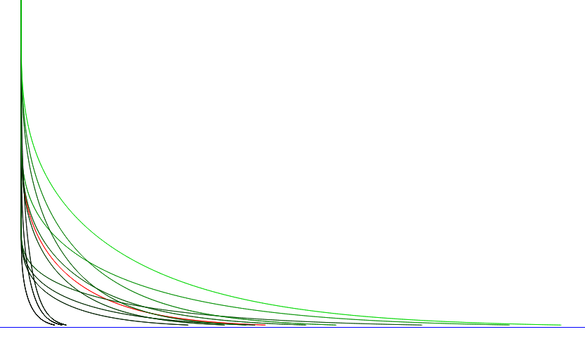

# Unified Path Following Guidance for Hybrid VTOLs

This repository contains the files related to the Bachelor Thesis project conducted at [Autonomous Systems Lab](https://asl.ethz.ch/), ETH Zurich during November 2022 ~ March 2023.

Supervisors:
- [Jaeyoung Lim](https://github.com/Jaeyoung-Lim)
- [Florian Achermann](https://github.com/acfloria)
- [David Rohr](https://asl.ethz.ch/the-lab/people/person-detail.MjAwMDE2.TGlzdC8yMDMwLDEyMDExMzk5Mjg=.html)
- [Thomas Stastny](https://github.com/tstastny)
- Professor [Roland Siegwart](https://asl.ethz.ch/the-lab/people/person-detail.Mjk5ODE=.TGlzdC8yMDI4LDEyMDExMzk5Mjg=.html)
- Professor [Hwangnam Kim](http://wine.korea.ac.kr/member/professor/)

Sponsor:
[Auterion](https://auterion.com/)

## Table of Contents

Contents of this repository breaks down into following categories:

1. [Weekly reports](./weekly_reports): Summary I sent to my supervisors with the progress, struggles, and questions of the week
1. [Project files](./project_management/): High level project related files
   - [Project description](./project_management/Unified%20path%20following%20guidance%20for%20aerial%20vehicles.pdf): Original work package description by my supervisors at ASL
   - [Time plan](./project_management/%E2%8C%9BJunwooHwang_timeplan.pdf)
   - [Weekly meeting notes](./project_management/%F0%9F%91%A8_%F0%9F%91%A8_%F0%9F%91%A7_%F0%9F%91%A6JunwooHwang_WeeklyMeetingNotes.pdf)
   - [Literature survey](./project_management/%F0%9F%93%9CJunwooHwang_literature_survey.pdf)
2. [Documentations](./documentations/): Documents generated during development process
   - [Daily Dose of ASL Research](./documentations/%F0%9F%9B%ABASL%20Thesis%20Daily%20Notes.pdf): A diary I kept throughout research, where I wrote all the little details on what I'm working on & doing, etc. Give it a read if you are bored!
   - [Vanilla NPFG Formulation - Jupyter Notebook](./documentations/3_TJ_NPFG_Scripting.ipynb): First stab I took at porting the PX4 NPFG into a python only file, whilst creating the unit tests as well. I was very satisfied with this effort!
3. [Scripts](./scripts/): Scripts generated during development process
   - [Windywings](./scripts/windywings/): OpenAI Gym based environment to test Fixed Wing dynamics
     - [Theories](./scripts/windywings/theories/): Scripts to visualize different vector field formulation theories, as well as the vector field formulation themselves
       - [Vector Field Algorithms](./scripts/windywings/theories/velocity_reference_algorithms.py): All the different proposed vector field formulation algorithms
       - [Acceleration and Course rates analysis](./scripts/windywings/theories/acc_course_rates_of_vel_curves.py): Initial analysis on resulting acceleration and course-rates from the vector field formulations, used for early stage discussions on jerk/acceleration limited NPFG formulation.
       - [Visualization of Vel ref curves](./scripts/windywings/theories/visualize_velocity_reference_curves.py): First version of the vector field analysis & visualization.
       - [Visualization of Vel ref curves v2](./scripts/windywings/theories/visualize_velocity_reference_curves_v2.py): Second & the last version of vector field analysis used for the final thesis.
     - [Simulations](./scripts/windywings/simulations/): Simulation scripts for Multirotor and Fixedwing dynamics using NPFG logic
       - [Fixed Wing NPFG Control](./scripts/windywings/simulations/fw_npfg_control.py): Simplest NPFG & FW Lateral dynamics based simulation
       - [Multirotor Fixed Wing difference](./scripts/windywings/simulations/mc_fw_pf_difference_demonstrate.py): Simulation for showing how differently multirotor and fixed wing reacts to a given NPFG environment (for comparison). Used for the GIFs in the final presentation for intuitive visualization.
       - [Multirotor NPFG pointmass control](./scripts/windywings/simulations/mc_npfg_pointmass_control.py): Simple NPFG & Multirotor point mass control based simulation
       - [Multirotor NPFG with different velocity curves](./scripts/windywings/simulations/mc_npfg_pointmass_control_velCurves.py): Simulation showing different results of using different velocity curves for the multirotor pointmass model. Used for comparing different velocity vector field formulations (acceleration, track error boundary, etc).
     - [Visualizations](./scripts/windywings/visualizations/): Visualization scripts
       - [Vector field](./scripts/windywings/visualizations/npfg_vectorfield.py): Visualizes a vector field around a straight path with NPFG logic
     - [Environment](./scripts/windywings/windywings/envs/)
       - [Fixed Wing Lateral Acceleration](./scripts/windywings/windywings/envs/fwlateral_env.py): Simple lateral acceleration based fixed wing guidance environment.
       - [Multirotor Point Mass](./scripts/windywings/windywings/envs/mc_point_mass_env.py): Point mass model of a multirotor that reacts to velocity setpoint & acceleration feed-forward with a P-controller.
       - [Fixed Wing & Multirotor NPFG Guidance](./scripts/windywings/windywings/envs/fw_mc_lateral_npfg_env.py): Joint of Multirotor and Fixed Wing dynamics (user can choose one to simulate) to simulate NPFG guidance.
     - [Libraries](./scripts/windywings/windywings/libs/)
       - [NPFG](./scripts/windywings/windywings/libs/npfg.py): Vanilla NPFG implementation straight from [PX4 source](https://github.com/PX4/PX4-Autopilot/tree/main/src/lib/npfg).
     - **Note**, the commit history of this other repository was imported using [this method](https://gist.github.com/martinbuberl/b58fd967f271f32f51f50aee62e7332c), which means 115 commits from the [original repository](https://github.com/Jaeyoung-Lim/windywings-gym/tree/pr_npfg_impl) has been merged into the commit history, so those commits will appear to have changed the files relative to the `scripts/windywings` directory, and not the root directory of this repo. Keep that in mind!
4. [Thesis LaTeX source & final file](./thesis_latex)
5. [Final Presentation](./final_presentation/)

## Final Presentation

Final presentation was held at Autonomous Systems Lab, on March 13th, 2023. Here are the [Slides for the presentation](./final_presentation)

## Contact

If you have any questions about the research, please don't hesitate to reach out to me via email in the final Thesis paper!

## Livestream & Procrastination

I procrastinated writing the thesis at the end so much, and live streamed my insane journey of completing the thesis by pulling an all-nighter.

This was the first part of the livestream (4 hours):

Second part of the livestream where I submit the thesis to the supervisors 1 minute before the deadline:

